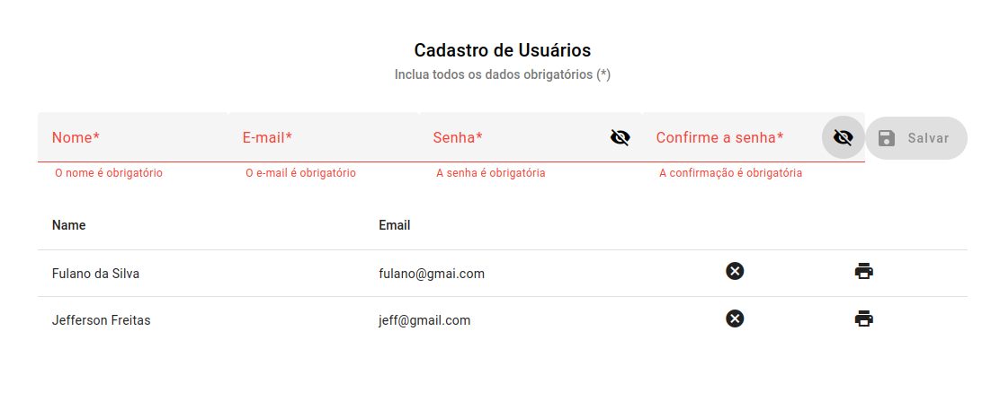

# Criação de Usuário (First Decision)

## Descrição Geral
Projeto (desafio First Decision) com frontend e backend que realiza o cadastro, remove e lista os usuários.

## Tecnologias
Angular (Frontend)
Java 17 com Spring Boot 3 (Backend)
PostgreSQL (Banco de Dados)

## Funcionalidades
1 - Cadastra o usuário com validação dos campos no frontend e backend.
2 - Persistência dos dados no banco de dados.
3 - Senha persistida criptografada no banco.
4 - Visualização dos registros já cadastrados no front (table)
5 - Opção de remover um registro
6 - Opção de detalhar um registro
7 - Ambiente dockerizado

## Como rodar o projeto

### Faça o clone
Faça o clone do projeto. No terminal rode o comando abaixo:
>git clone https://github.com/jeffersonfreitas-dev/desafio.first-decision.git

### Entre na pasta do projeto
>cd desafio.first-decision

### Rode o Docker-compose
Lembre de adicionar o 'sudo' caso não tenha permissão de rodar o docker.
> docker-compose build && docker-compose

## Imagens

### Tela de cadastro e listagem.
